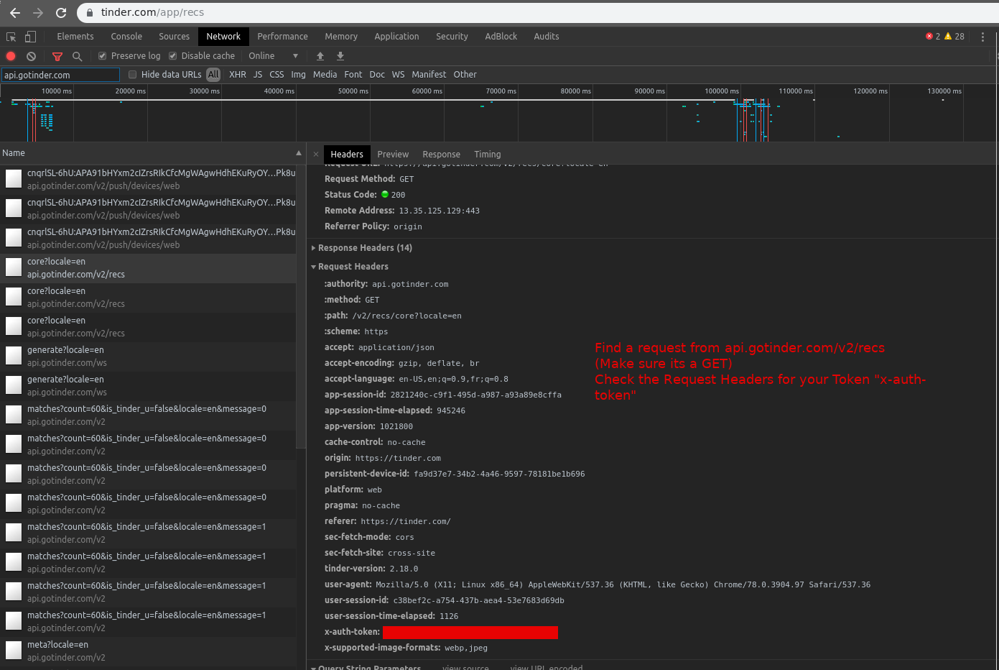

# Tinder api -> Python-bindings

This project contains python bindings for the unoffical tinder api. The tinder api is constantly changing and current libraries are not always up to date. This project is a mix of Pynder's style and Fbessez's endpoints/auth. Current a work in progress but is suitable for non-production projects.

## UPDATED AUTHENTICATION - (12/30/19)

Tinder switched away from account-kit. Please use the SMS auth file(updated 12/30) to get your tinder token. I suggest hard coding it into the config.py file after you have obtained it.
If sms_auth is not working for you, you can find your tinder token using chrome inspector tool. Login to tinder.com, and search it the network tab for a request from the api. Check the request Headers for x-auth-token. Once you copy it, paste it into config.py. See photo.


Please note, as of this update, I only tested through the example, and it all seemed to work. :)
I have built two other projects off this api, include an auto swiper (tensorflow) and a GUI (Very unfinished). Feel free to check them out if you would like, but clone this repo as it is the most up to date api.

## Getting Started

You will need to insert your tinder_token in the utils/config.py file. This currently uses SMS auth method for verification as FaceBook auth has changed.
Clone this repo, in your project import tinder_api and get to work. The example.py shows how to get rolling.

## Usage

```
import tinder_api.session

sess = tinder_api.session.Session() # creates a session

print(sess.meta) # prints your meta data
sess.update_profile(bio="I love VIM") # updates your bio - see kwargs

for user in sess.yield_users():
    user.name
    user.id
    user.age
    user.bio
    user.gender # male or female
    user.photos # url of the photos
    user.like() # swipe right
    user.pass() # swipe left
    user.super_like() # swipe up

    user.report(1) # report for spam

for match in sess.yield_matches():
    match.name # all the same endpoints as a normal user
    match.match_data # contains match data like messages/profile
    match.message('Hello, I use VIM so I am superior to all those other programmers you've dated')
    match.get_messages()
```

## Authors/Acknowledgments
* ** Michael ** - *Initial Work* [MMcintire96](https://github.com/MMcintire96)
* ** Sharkbound ** - *Json Wrapper* [sharkbound](https://github.com/sharkbound)
* ** Wowotek ** - *Pull requests, cleanup and design* [wowotek](https://github.com/wowotek)


## TODO

1. Move more methods to JsonWrapper
2. Optimize for speed -- UserController + NormalUser = 1.5s, MatchUser = 3.0s
3. Maybe add Routes.py
4. Fix FB Auth Method
